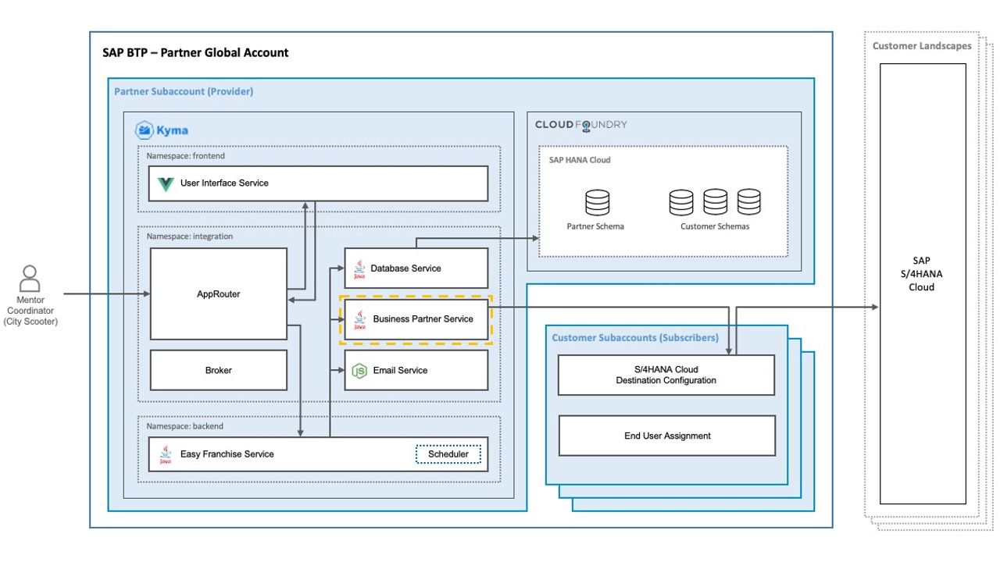
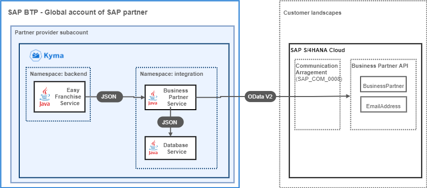

# Business Partner Service

 

The Business Partner service (BP service) is taking care of the calls going to the SAP S/4HANA Cloud system in order to load all the business partners (franchisees) of the customer.

The service is deployed in the namespace *integration* of the Kyma account. 

Here is a detailled overview of the BP service connections:

* The BP service reads BusinessPartners from the SAP S/4HANA Cloud system via an OData v.2 API.
* The BP service requests also other information from the DB Service, for example, the subdomain name for the current tenant.
* The BP service provides a json API, which will be called by the Easy Franchise service.

 

## Understanding the OData endpoint of SAP S/4HANA
OData (Open Data Protocol) is a standard that defines a set of best practices for building and consuming REST APIs. A metadata document defines available entities and methods. With this metadata you are able to execute read/filter/create/update/delete Rest API's to manipulate entities. For more details, see https://www.odata.org/documentation/odata-version-2-0).

Read the follwoing chapter [Enable the Business Partner OData V2 Rest API in an SAP S/4HANA Cloud system](documentation/appendix/enable-odata-of-s4hana/README.md) 
which explains you how to enable the OData V2 Rest Endpoint for a communication arragement user. 

The Business Partner data model is exposed via the following GET request (use Basic Auth with the communication arrangement user):

```
https://<your s4 endpoint>/sap/opu/odata/sap/API_BUSINESS_PARTNER/$metadata
```

As we want only the Entity for *A_BusinessPartner*, we need to restrict the request as followed:

```
https://<your s4 endpoint>/sap/opu/odata/sap/API_BUSINESS_PARTNER/A_BusinessPartner
```

In order to consume the data without using an OData java library, we are transforming it to JSON by adding ```--header 'Accept: application/json'``` to the REST call.

For our scenario, we are only interested in Business Partners of category Organization. Here is an example of a request:
```
https://<your s4 endpoint>/sap/opu/odata/sap/API_BUSINESS_PARTNER/A_BusinessPartner?$filter=BusinessPartnerCategory eq '2' & $expand=to_BusinessPartnerAddress/to_EmailAddress
```

Here a JSON example showing the structure of the response (in reality there a much more properties!):
```
{
    "d": {
        "results": [
            {
                "BusinessPartner": "10100001",
                "BusinessPartnerFullName": "Inlandskunde DE 1",
                "to_BusinessPartnerAddress": {
                    "results": [
                        {
                            "BusinessPartner": "10100001",
                            "AddressID": "22807",
                            "CityName": "Schoental",
                            "Country": "DE",
                            "StreetName": "Lindenstrasse",
                            },
                            "to_EmailAddress": {
                                "results": [
                                    {
                                        "AddressID": "22807",
                                        "IsDefaultEmailAddress": true,
                                        "EmailAddress": "info@10100001.com",
                                    }
                                ]
                            },
                        }
                    ]
                },
            },
            {
                "BusinessPartner": "10100002",
                ...
            },
            ... all other BusinessPartners
        ]
    }
}
```


## Service Implementation

The BP service is a Java module of the [parent pom](../../../code/backend/pom.xml):
```
<project>
	<modules>
		<module>bp-service</module>
        ...
	</modules>
</project>
```

[BPService.java](../../../code/backend/bp-service/src/main/java/dev/kyma/samples/easyfranchise/bpservice/BPService.java) implements the REST services.
The method *getBusinessPartner* first gets the destination details (SAP S/4HANA Cloud URL and authorization properties) from the destination configured in the subaccount and then performs the OData request against the SAP S/4HANA Cloud system.

<!-- 
## Workaround for running the application locally
When running BP Services local the problem arises how to access the SAP S/4HANA Cloud system. In the final Kyma runtime the destination definition of the customer subaccount will be used. But as we don't want to  mock all of this, a system property *local_dev=true* is introduced so that the local run can differ from the kyma run. In local run destination details area read from a hiddenconfig.properties. (In section [Start and Test the Microservices DBService, EFService and BPService](step-by-step-guide/run-app-locally/../../../../step-by-step-guide/run-app-locally/start-and-test-microservices/README.md) you can read how to configure the hiddenconfig.properties file)

    

The method *getDestinationData* of [DestinationUtil.java](/code/backend/shared-code/src/main/java/dev/kyma/samples/easyfranchise/communication/DestinationUtil.java) makes use of *local_dev*  system property as the follwoing code snippet shows: 
```
    public static ConnectionParameter getDestinationData(String subDomain, String destinationName) throws Exception {
        Destination destination = null;
        if (Util.isLocalDev()) {
            destination= Util.getBPDestinationForLocalDev(destinationName);
        } else {
            destination = getDestinationfromDestinationService(subDomain, destinationName);
        }
        ...
```    
-->    

## List of API Endpoints

The path of all APIs begins always with ``/easyfranchise/rest/bpservice/v1/<TENANT-ID>``. It is then followed by the path listed below for each individual REST call. 

| Path      | Description    | Curl Example  |
|:----------|:---------------|:--------------|
| bupa      |Get all BusinessPatners  |``curl --verbose --request GET 'http://<localhost:8100>/easyfranchise/rest/bpservice/v1/<tenantid>/bupa' `` |
