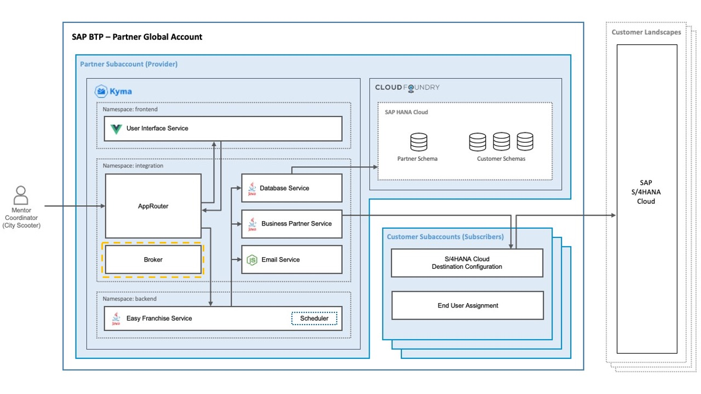

# Broker

 
This section demonstrates how to integrate SaaS Provision service to onboard/offboard new tenants. This is achieved by the following parts:

- Implement callback functions for onboarding, offboarding and getDependency.
- Deploy broker and its Kubernetes service
- SaaS Provision service instance

## Implement Callback Functions

The broker provides the following callbacks:

- onSubscription: For onboarding/offboarding purpose. For the new tenant, the function takes care of constructing (1) an unique app URL and (2) its corresponding APIRule, and (3) setting up proper database schema for the new tenant.

- getDependencies: Return a list of dependent services. In our scenario **Destination** service is returned as dependent service.

The full implementation can be found in [server.js](../../../code/broker/server.js) under folder [broker](../../../code/broker).

For more details of callback functions, refer to the [official documentation](https://help.sap.com/viewer/65de2977205c403bbc107264b8eccf4b/Cloud/en-US/3971151ba22e4faa9b245943feecea54.html).

## Deploy Broker with Service

Our callbacks are implemented using Node.js. Then the application is dockerized and deployed to Kyma along side a Kubernetes service to expose the application within Kyma cluster.  

The full deployment YAML file can be found in [deployment.yaml](../../../code/broker/k8s/deployment.yaml).

The tenant specific application URL is exposed through APIRule, which needs to be created dynamically through onboarding/offboarding process using [Kubernetes client for NodeJs](https://github.com/kubernetes-client/javascript). To create such APIRule, proper RoleBinding is granted through following definition:

```yaml
apiVersion: rbac.authorization.k8s.io/v1
kind: RoleBinding
metadata:
  name: broker-rolebinding
  namespace: integration
subjects:
  - kind: ServiceAccount
    name: default
    namespace: integration
roleRef:
  kind: ClusterRole
  name: kyma-namespace-admin
  apiGroup: rbac.authorization.k8s.io  

```

## Create SaaS Provision Service Instance

The last part of this section is to create a SaaS Provision service. Following code snippet shows definition of SaaS Provision service for Kyma. 

Note:

- Parameter **xsappname** must match the value of the same parameter defined in SAP Authorization and Trust Management service.

- Parameter **displayName** technically does not need to be unique. However, in case of deploying the application **with the same display name in multiple sub accounts under one global account**, having a unique name would help to identify the subaccount from which the application is subscribed. In the following example the subdomain of the subaccount is added for such purpose. 

- An APIRule for subscription is created so that the callback is reachable. Those callbacks need to be implemented by the application provider (discussed above).

- Two placeholders `<provider-subdomain>` and `<cluster-domain>` are defined below, and will be replaced by deployment script. Please refer to section [ManualDeployment](../../step-by-step-guide/run-app-in-kyma/deployment/ManualDeployment.md) for more details.

```yaml
# Resource to create instance for SaaS Registry services
apiVersion: servicecatalog.k8s.io/v1beta1
kind: ServiceInstance
metadata:
  name: saas-registry-service
  namespace: integration
spec:
  clusterServiceClassExternalName: saas-registry
  clusterServicePlanExternalName: application
  parameters:
    # the xsappname refers to the one defined in xsuaa service
    xsappname: easyfranchise
    displayName: Easy Franchise (Multitenant) <provider-subdomain>
    description: An application on Kyma with multi-tenant
    category: "Demo applications"
    appUrls:
      # url registered in the kyma-broker which handles SaaS provisioning (subscription/deletion of saas instances)
      onSubscription: https://subscription.<cluster-domain>/callback/v1.0/tenants/{tenantId}
      getDependencies: https://subscription.<cluster-domain>/callback/v1.0/dependencies

```
