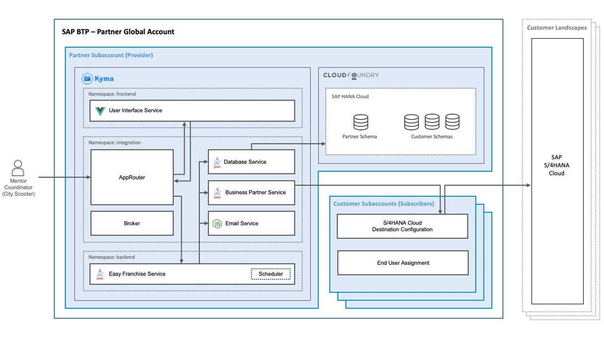

# Explore

The Easy Franchise application is structured in multiple microservices. In this section, you can explore and find out a detailed documentation of all the components of the application. These components are grouped in 3 different namespaces:

* Namespace frontend 
  * [UI](ui/README.md)

* Namespace integration
  * [Database Service](db-service/README.md)
  * [Business Partner Service](bp-service/README.md)
  * [Email Service](email-service/README.md)
  * [Approuter](approuter/README.md)
  * [Broker](broker/README.md)

* Namespace backend
  * [EasyFranchise Service](ef-service/README.md)

Namespaces in Kubernetes can be seen as kind of virtual clusters. Their main purpose is to spread projects or mutltiple teams across the environment. It also provides some security aspects as you can apply more fine-grained authorizations on namespaces level and your workloads are limited by default to the namespaces they are running in. For more details on namespaces, see [Namespaces](https://kubernetes.io/docs/concepts/overview/working-with-objects/namespaces/) in the Kubernetes documentation. The decision to split our application into several namespaces is only to showcase how it could be done. Normally, for an application of that size you would not split it into different namespaces.

## Additional Information about the Java Microservices

The following services are implemented in Java:

* Database service
* Easy Franchise service (with Scheduler)
* Business Partner service

They are all built via this parent [pom.xml](../../backend/pom.xml).

To keep the services as lean as possible, we decided against using a full-fledged application server like Tomcat or WildFly. Instead, we added just the Maven dependencies that were needed for implementing REST service that work on JSON objects:

* [Jetty Server](https://www.eclipse.org/jetty/) Embeddable web server and servlet container
* [Jersey](https://eclipse-ee4j.github.io/jersey/) Reference Implementation for Jakarta RESTful Web Services
* [Yasson](https://projects.eclipse.org/projects/ee4j.yasson) Reference Implementation for Jakarta JSON Binding

All Java miroservices are started in a very similar manner. There is a *main()* method that is called either from a shell in a local dev environment or from inside the docker images when running on Kyma. For implementation details, see [Easy Franchise ServerApp class](../../backend/shared-code/src/main/java/dev/kyma/samples/easyfranchise/ServerApp.java).
