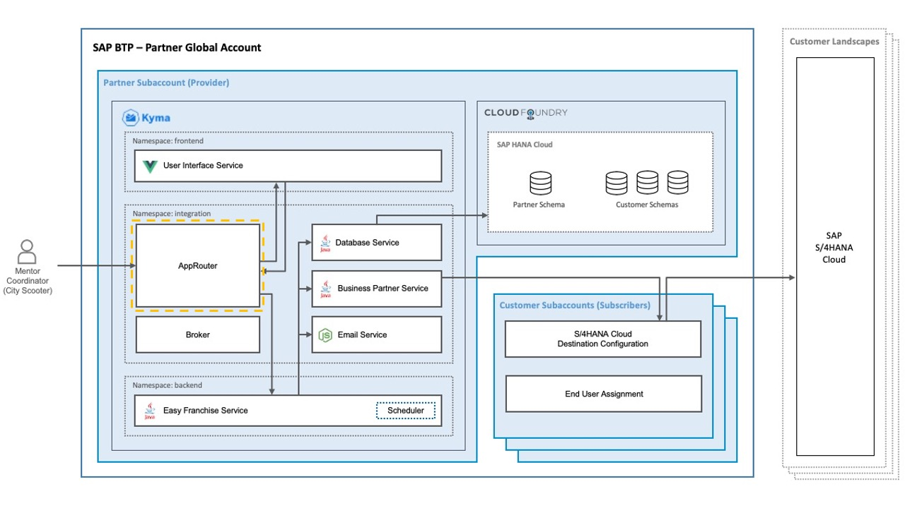
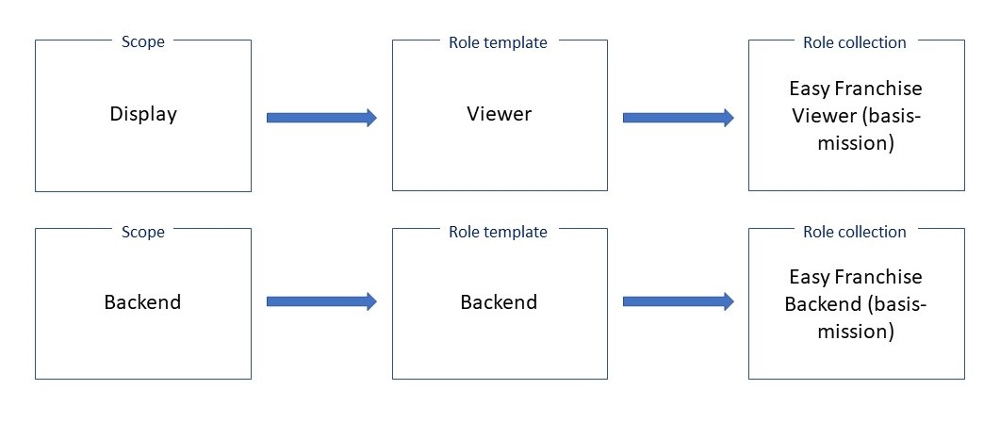

# Understand the Approuter



The Approuter is a Node.js [module](https://www.npmjs.com/package/@sap/approuter) that is available on NPM. It represents a single entry point to an application. It has the responsibility of performing authentication, authorization, and forwarding requests to the Easy Franchise service.

Here are the major actions performed by the Approuter:
* Receive requests from end users, as it's the only entry point to the application and redirects end user to the SAP Authorization and Trust Management service to log in.
* Extract the tenant ID from the JWT token sent by the SAP Authorization and Trust Management service.
* Redirect end user to UI after login.
* Inject the tenant ID in the request sent from the UI to the Easy Franchise service.

  Here is the explanation of the steps in the previous diagram:
  1. As soon as a customer is onboarded, the SaaS Registry triggers the onboarding process. Call goes first via Approuter, which receives the tenant ID in the body request.
  1. The broker extracts the tenant ID and subdomain out of the request body and triggers actions defined in the callbacks. In our case, the database service is informed about the new onboarding.
  1. The Database service creates a new schema for the new customer and standard tables and data are automatically generated.

## Configuring Approuter

The routes are defined in [xs-app.json](/code/approuter/xs-app.json). For example, if the request URL pattern follows 'ui/path', the 'path' will be extracted and forwarded to destination "ui" (destination setup will be explained in below section). A scope check (authorization check) will also be performed automatically by the Approuter against the SAP Authorization and Trust Management service instance before forwarding the request to corresponding destination.

```json
{
    "welcomeFile": "/ui/index.html",
    "routes": [
        {
            "source": "^/broker/(.*)$",
            "target": "$1",
            "destination": "broker"
        },
        {
            "source": "^/ui/(.*)$",
            "target": "$1",
            "destination": "ui",
            "scope": ["$XSAPPNAME.Display", "$XSAPPNAME.Backend"]
        },
        {
            "source": "^/backend/(.*)$",
            "target": "$1",
            "destination": "ef-service",
            "csrfProtection": false,
            "scope": ["$XSAPPNAME.Backend"]
        },
        {
            "source": "^/css/(.*)$",
            "destination": "ui",
            "authenticationType": "none"
        },
        {
            "source": "^/js/(.*)$",
            "destination": "ui",
            "authenticationType": "none"
        },
        {
            "source": "^/img/(.*)$",
            "destination": "ui",
            "authenticationType": "none"
        }
    ]
}
```

Destinations such as "ui" or "ef-service" are defined in the [config map](/code/approuter/k8s/deployment.yaml). The URL behind each destination points to the corresponding service, which handles the request.

```yaml
apiVersion: v1
kind: ConfigMap
metadata:
  name: destinations-config
  namespace: integration
data:
  destinations: |
    [
      {"name":"ef-broker","url":"http://ef-broker.integration.svc.cluster.local:3002","forwardAuthToken" : true},
      {"name":"ef-ui","url":"http://ef-ui.frontend.svc.cluster.local:80","forwardAuthToken" : true},
      {"name":"ef-service","url":"http://efservice.backend.svc.cluster.local:80","forwardAuthToken" : true}
    ]
```

As mentioned before, the scopes are also defined in the xs-app.json file so that the request will be only forwarded if the user has one or more required scopes.

<!--
As an alternative, you could also check the scope by using a custom middleware as describe below. Please note that scope check only needs to be implemented once, i.e. either in the xs-app.json as shown above, or in the custom middleware as below.

```javascript
var ar = approuter();
ar.beforeRequestHandler.use('/', function (req, res, next) {

    if (!req.user) {
        res.statusCode = 403;
        res.end("Missing JWT Token");
    }

    xssec.createSecurityContext(req.user.token.accessToken, xsenv.getServices({uaa:{tag:'xsuaa'}}).uaa, function(error, securityContext) {
        if (error) {
            res.statusCode = 401;
            res.end("Security context creation failed: " + error);
        }
        if (securityContext.checkLocalScope("Display")) {
            res.statusCode = 200;
            console.log("authorization checked!");
            next();
        } else {
            res.statusCode = 403;
            res.end("User does not have proper role to access the app.");
        }
    });
});
```
-->


## Extending the Approuter with a Custom Middleware

The Approuter can typically be used as a standalone application to be the single entry point for other microservices. As the Easy Franchise application is multitenant, you need to provide the tenant ID by each request to the backend. Therefore, the Approuter is extended with a custom middleware. For that purpose, you use a custom [start script](/code/approuter/approuter-start.js), which is referenced in the [package.json](/code/approuter/package.json). With the help of this custom middleware, every request sent to the backend gets an HTTP header with tenant ID. The following code snippet shows the implementation:

> Note: This is a technical requirement of our application and might not be applicable in general. Alternatively, the backend component (for example, the Easy Franchise service) could extract the tenant ID directly from the forwarded JWT token.

```javascript
var ar = approuter();
ar.beforeRequestHandler.use('/backend', function (req, res, next) {
    const token = req.user.token.accessToken;
    if (!token) {
        res.statusCode = 403;
        res.end("Missing JWT Token");
    }else {
        const decodedToken = jwt_decode(token);
        const tenant = decodedToken && decodedToken.ext_attr && decodedToken.ext_attr.subaccountid;
        req.headers['x-tenant-id'] = tenant;
        console.log("set header x-tenant-id to tenant id : "+ tenant);
        next();
    }
}
```

You can find more details on extending Approuter in [SAP BTP documentation](https://help.sap.com/viewer/4505d0bdaf4948449b7f7379d24d0f0d/2.0.01/en-US/6abdedefcb1f47878a07d49919124eef.html).

## SAP Authorization and Trust Management Service

The definition of the custom scopes and role collections are defined in the SAP Authorization and Trust Management service instance. Details can be found in the file [deployment_service.yaml](/code/approuter/k8s/deployment_service.yaml). The instance defines two scopes *Display* and *Backend*. In addition to that, two roles templates *Viewer* and *Backend* are defined respectively. Lastly, two role-collections are defined using role templates. Note that the name of role-collections must be unique across different subaccounts, otherwise the creation of the SAP Authorization and Trust Management service instance will fail in case of a name conflict. In our case, the subaccount domain <provider-subdomain> is appended to make the role collection name unique.



Moreover, a standard *callback* scope is included in order to onboard/offboard new customers.

```yaml
apiVersion: servicecatalog.k8s.io/v1beta1
kind: ServiceInstance
metadata:
  name: xsuaa-service
spec:
  clusterServiceClassExternalName: xsuaa
  clusterServicePlanExternalName: broker # unified service plan 'broker': https://jam4.sapjam.com/blogs/show/2dxT4cVGxTXZRJT0D1DQQM
  parameters:
    xsappname: easyfranchise
    tenant-mode: shared # use "shared" for multi-tenant application
    scopes:
      - name: $XSAPPNAME.Display
        description: Display Scope
      - name: $XSAPPNAME.Backend
        description: Backend Scope
      - name: $XSAPPNAME.Callback
        description: With this scope set, the callbacks for tenant onboarding, offboarding and getDependencies can be called.
        grant-as-authority-to-apps:
          - $XSAPPNAME(application,sap-provisioning,tenant-onboarding)
    role-templates:
      - name: Viewer
        description: Viewer Role-Template
        scope-references: [$XSAPPNAME.Display]
      - name: Backend
        description:  Backend Role-Template
        scope-references: [$XSAPPNAME.Backend]
    role-collections:
      - name: Easy Franchise (UAA) Viewer Role Collection <provider-subdomain>
        description: Viewer Role-Collection
        role-template-references: [$XSAPPNAME.Viewer]
      - name: Easy Franchise (UAA) Backend Role Collection <provider-subdomain>
        description: Backend Role-Collection
        role-template-references: [$XSAPPNAME.Backend]
...
```

## (Optional) Authentication Using the Identity Authentication Service

The SAP BTP has its own default identity provider. If needed, SAP BTP supports also identity federation, so that user identities from other systems can be used. To enable communication between SAP BTP and the custom identity provider (for example, Identity Authentication), you must cross-configure the communication endpoints of the involved systems, establishing a trust relationship between them. See the [SAP BTP documentation](https://help.sap.com/viewer/65de2977205c403bbc107264b8eccf4b/Cloud/en-US/7c6aa87459764b179aeccadccd4f91f3.html#loio7c6aa87459764b179aeccadccd4f91f3) for more details.
